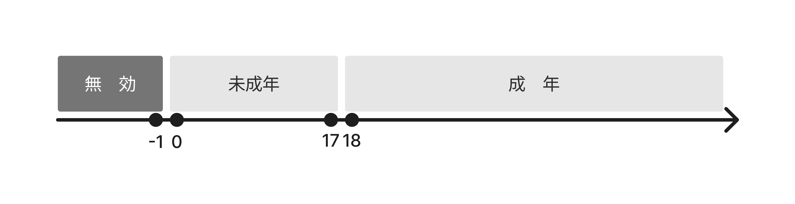
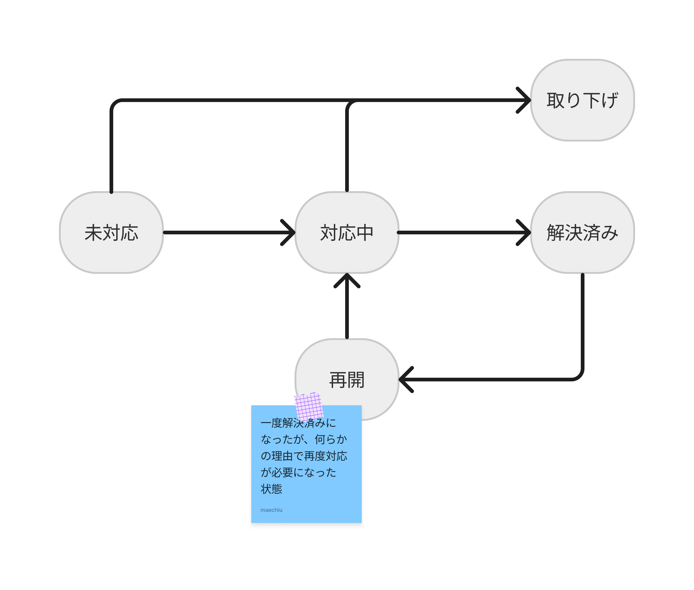
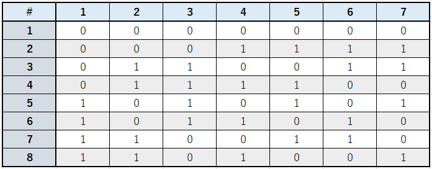
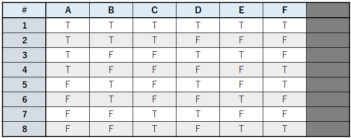

# ソフトウェアテスト技法勉強会

## 主にブラックボックスで使う技法編

---

この勉強会では、ブラックボックステストで用いられる  
テスト技法について、その説明と実践を行います。

テスト技法とは、テスト内容を検討する際に活用できる
先人たちの知恵、テクニックです。


---

## ブラックボックステストとは？

- **内部の仕組みには注目しない**  
  コードを一切見ず、利用者の立場でテストします。

- **外から見える振る舞いをチェック**  
  システムが正しく動くか、出力が期待に合っているかを見ます。

- **多様なシナリオを想定する**  
  予期せぬ使い方や入力にも対応できるかをテストします。

---

## ホワイトボックステストとは？

システムの内部構造、ロジック、オペレーションに焦点を当てます。

- **内部を詳しく調査**
    コードを詳しく調査し、開発者の立場でテストします。
- **コードレベルでの正確性を検証**
    プログラムの分岐、ループなどのパスを通るようにテストケースを考えたり  
    脆弱性がないかテストしたりなどなど。

---

## 黒箱と白箱のどっちを採用するのがいいの？

- **ブラックボックステスト**
  客観的な視点での機能テストが求められる場合。

- **ホワイトボックステスト**
  綿密な技術的検証や内部構造の検証が必要な場合。

**両方のアプローチを組み合わせることで、より効果的なテストができます。**

---

## ブラックボックステストの主な技法

- 同値分割（Equivalence Partitioning）
- 境界値分析（Boundary Value Analysis）
- 状態遷移テスト（State Transition Testing）
- デシジョンテーブルテスト（Decision Table Testing）
- ペアワイズ / 直交表テスト（ Pairwise / Orthogonal Array Testing）

---

# 同値分割

---

## 同値分割の概要

入力値の集合について、テスト対象を動作させたときに同じ動作結果をもたらすと想定できるグループでまとめて、各グループ内の代表値のみをテストする。

代表値のみテストすることで、テストすべき値を大幅に削減する技法です。

## 同値分割の使いどころ

本格的なテストの前に、代表値のみで簡易的なテストを実施したい場合。

---

## 同値分割の適用例 （関数の単体テストに適用してみる）

```typescript
/**
 * Determines if a person is an adult based on their age.
 * @param age - The age of the person.
 * @returns True if the person is an adult, false otherwise.
 */
function isAdult(age: number): boolean 
```



---

## 同値分割から作成したテストケース

| No | 入力値 | 期待する結果 |
| ---- | ---- | ---- |
| 1 | -1 | エラー |
| 2 | 10 | false (未成年) |
| 3 | 20 | true (成年) |

---

## テスト駆動で関数を実装してみる。

---

# 境界値分析

---

## 境界値分析の概要

**仕様やコード中に示される値を境にして処理内容が変わるとき、その境界付近の値をテスト値として選択する。**

境界付近に欠陥が見つかりやすいことに着目した技法です。同値分割で境界を見つけてから適用します。

---

## 境界値分析の使いどころ

**対象の入力値が数値など順序付けられている要素の場合で、入力値すべてのテストが困難な場合。**

整数や実数（小数点数）で表される入力値に適用できます。日付、時間、桁数、文字数、要素数、容量などが該当します。これらの値は境界に欠陥が見つかりやすいことがわかっているので、積極的に適用します。


---

## 境界値分析の適用例 （関数の単体テストに適用してみる）

```typescript
/**
 * Determines if a person is an adult based on their age.
 * @param age - The age of the person.
 * @returns True if the person is an adult, false otherwise.
 */
function isAdult(age: number): boolean 
```


---

## 境界値分析から作成したテストケース

| No | 入力値 | 期待する結果 |
| ---- | ---- | ---- |
| 1 | -1 | エラー |
| 2 | 0 | false (未成年) |
| 3 | 17 | false (未成年) |
| 4 | 18 | true (成年) |

---

## 境界値分析の適用例 （ [REST API](http://localhost:3000/docs#/complaints/ComplaintsController_create) に適用してみる）

- リクエストボディの`lot`についてテストケースを考えてみましょう。

---

# 状態遷移テスト

---

## 状態遷移テストの概要

**状態、イベント、遷移を用いた状態遷移設計に基づいて、遷移の組み合わせを網羅したり、複数回遷移するようなテストケースを作成する。**

状態遷移設計の主な表現方法は、状態遷移図と状態遷移表です。設計段階で作られるこれらの状態遷移設計を利用したり、なければテスト用に状態遷移図（表）を作成するなどして、テストケースを作成します。また、主な状態遷移テストには、マトリクステストとパステストの2種類があります。

---

## マトリクステスト

- 状態 x イベントで示された状態遷移表の全組み合わせをテストする
- １回の状態遷移が意図通りに行われるかを確認できる

---

## パステスト

- 状態遷移図の遷移パスをテストする
- 状態遷移を連続したときに意図通りに遷移するかどうか、副作用が発生しないかを確認できる

---

## 状態遷移テスト適用例

苦情管理Webアプリの、苦情の状態が右図のようなものと仮定して
テストを考えてみましょう。

[REST API](http://localhost:3000/api#/complaints/ComplaintsController_update)



---

## マトリクステスト適用例

| No | 事前状態 | 入力値 | 事後状態 |
| ---- | ---- | ---- |  ---- |
| 1 | 未対応 | 対応中 | 対応中 |
| 2 | 未対応 | 取り下げ | 取り下げ |
| 3 | 対応中 | 取り下げ | 取り下げ |
| 4 | 対応中 | 解決済み | 解決済み |
| 5 | 解決済み | 再開 | 再開 |
| 6 | 再開 | 対応中 | 対応中 |

---

## パステスト適用例

- 未対応 -> 対応中 -> 取り下げ
- 未対応 -> 対応中 -> 解決済み
- 未対応 -> 対応中 -> 解決済み -> 再開 -> 対応中 -> 解決済み

---

# デシジョンテーブルテスト

---

## デシジョンテーブルテストの概要

**複数の入力値の組み合わせによる相互作用を、「デシジョンテーブル」と呼ばれる表に定義し、表の内容をテストする。**

デシジョンテーブルはテストだけでなく、設計において複雑な条件を整理したり定義したりするのに用いる表です。JISでは「JISX0125決定表」として定義・標準化されています。

---

## デシジョンテーブルテストの使いどころ

**対象が複数の入力条件を持ち、かつ入力条件同士に優先度や依存などの関係性が見られる場合**

### 入力条件の関係性とは

例えば、 **年齢が１８歳未満の場合、保護者氏名、保護者メールアドレス、保護者年齢が必須**のように、ある入力値の値によっては、その他の入力値に依らずに結果が決まる。というような関係。（年齢が１８以上なら、保護者関連の入力値は不要になる）

---

## デシジョンテーブルの適用例

```typescript
/**
 * Represents a person.
 * 
 * `name` - The name of the person. It must less than 100 characters.
 * `email` - The email of the person. It must be a valid email.
 * `age` - The age of the person. It must be greater than or equal to 0.
 */
interface Person {
  name: string;
  email: string;
  age: number;
}

/**
 * Determines if a person is registerable.
 * 
 * A guardian is required if the person is under 18.
 * In that case, the guardian must be an adult (age >= 18).
 * 
 * @param person - The person to check for registerability.
 * @param guardian - An optional guardian for the person. Required if `person` is under 18.
 * @returns True if the person is registerable, false otherwise.
 */
function isRegisterable(person: Person, guardian?: Person): boolean
```
---

Excel で テーブルをつくってみる

---

# ペアワイズ / 直行表テスト

---

# ペアワイズ / 直行表テストの概要


**複数の入力パラメータがあるとき、そのうちどの二つのパラメータの組み合わせを選んでも、各パラメータのとりうる値の組み合わせが網羅されているようなテストケースを設計する**

- true/falseの二値をとる入力条件が７つ　=> 2^7 = 128 通り
  - ペアワイズ、直行表で8件まで削減！
- 「**ほとんどの欠陥が1個～数個の入力値の組み合わせに起因する**」という経験則を根拠としている。

---

# ペアワイズ / 直行表テストの使いどころ

- テスト対象が複数の入力条件を持ち、かつ入力条件同士が互いに影響しないと期待される場合
- 構成テスト（Webアプリにおける、ブラウザの種類、バージョン、OSの種類の組み合わせテストのようなもの）
  - 組み合わせが変わっても、動作結果に影響しないことを確認する。

---

# 直行表って？

- どの2列を見ても、とりうる値の組み合わせが全て出現する表(下表は L4直行表)。

|#|1|2|3|
|---|---|---|---|
|1|0|0|0|
|2|0|1|1|
|3|1|0|1|
|4|1|1|0|

- 各列のとりうる値は `0` , `1` の二値
- どの2列を選択しても、(0,0), (0,1), (1,0), (1,1)が1回ずつ出現する。

---

## どうやってつかう？
対象にtrue/falseをとる入力条件(A~F)が
６個あると仮定すると...
- 二値の条件を7個まで使える **L8直行表** を使う。
- 0: true, 1: false 、列１つを入力条件として割り当てていく




---



---

え？めんどくさくない？
しかも、入力が２値とは限らないでしょ？

---

ごもっとも。[ツール](https://github.com/microsoft/pict)を使いましょう。
